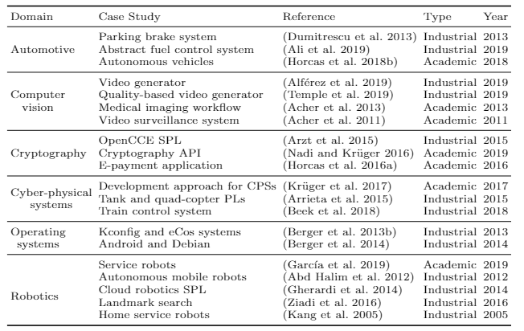

# Case studies requirements
The review of case studies and domains answer the following research question:
> Which variability modeling characteristics and SPL activities are required by the most demanding case studies in the SPL community?

We answer this question by selecting a sample group of studies mainly used in the SPL community for research and evaluation.

**Sample of case studies:**

This project contains the following artifacts to replicate and/or improve the sampling study:

## Artifacts
* Data extraction form [(Google Form)](https://docs.google.com/forms/d/e/1FAIpQLSd5ozfEBF6Mx4FG5qIUxyz7UK4f2B75v-aHgne8wiMdBUYlVA/viewform?usp=sf_link)
* Responses of the data extraction form ([.csv file](Case Studies Requirements - Data Extraction Form.csv)).
* Tables in the paper show the details extracted from the case studies classified by domains. This includes: name, main reference, type (academic, industrial, real word,...), a brief description and the SPL and variability requirements.

## Procedure
How to proceed to replicate the sampling about variability and SPL requirements of the case studies, or to add new case studies:

1. Use the [data extraction form](https://docs.google.com/forms/d/e/1FAIpQLSd5ozfEBF6Mx4FG5qIUxyz7UK4f2B75v-aHgne8wiMdBUYlVA/viewform?usp=sf_link) to add the information of each case study.

 The basic information of each case study to gather in the data extraction form is:  
    `Reference (URL), name of the case study, domain, year (of the reference publication), type of case study (industrial, academic, real world, other,...), brief description, and variability and SPL requirements.`

2. The information gathered is automatically stored in a .csv file synchronized with the data extraction form.

## References
* [Google](https://www.google.com/)
* [Google Forms](https://www.google.es/intl/en/forms/about/)
* [Google Sheets](https://www.google.es/intl/en/sheets/about/)
* [Microsoft Excel](https://products.office.com/es-es/excel?rtc=1)
