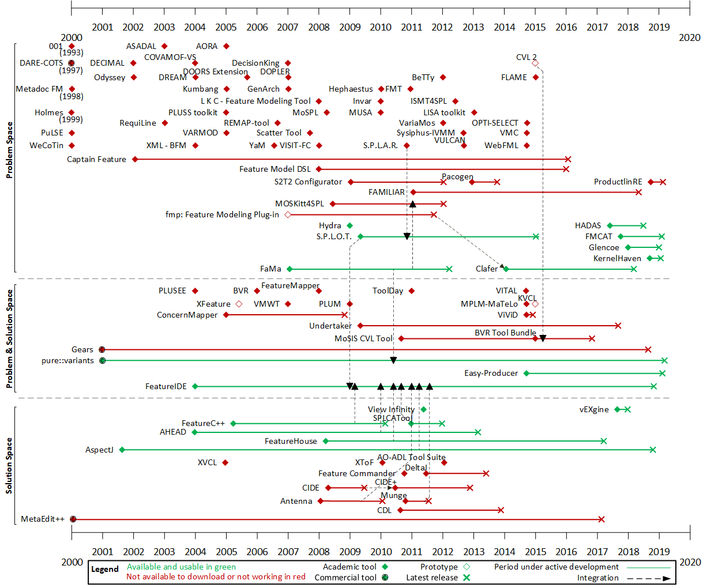

# State of the art
The state of the art answers the following research question:
> What tools exist that provide support for SPLs?

Timeline with all SPL tools published until December 2019:

The state of the art gives a wide vision of the current state of art of the SPL tools and helps practitioners to select appropriate toolsroadmaps helps to integrate independent tools.
This project contains the artifacts and instructions to replicate and/or improve the state of practice.

## Artifacts
* Data extraction form [(Google Form)](https://docs.google.com/forms/d/e/1FAIpQLSczgT5cgYXQuh7d2bp6ZtF-1wNfzXXNT5WZM-vCOZ0Oi9lbCw/viewform?usp=sf_link)
* [Timeline](timeline.png) with all SPL tools published until December 2019.
* Responses of the data extraction form ([.csv file](SPL Tools - Data Extraction Form.csv)).
* Responses of the data extraction form ([.xlsx file](SPL Tools - Data Extraction Form.xlsx)) modified for extracting statistics with R.
* [R script](statistics-script.R) to get stastitics summary.

## Procedure
How to proceed to replicate the state of practice and/or add new tools:

1. Use the [data extraction form](https://docs.google.com/forms/d/e/1FAIpQLSczgT5cgYXQuh7d2bp6ZtF-1wNfzXXNT5WZM-vCOZ0Oi9lbCw/viewform?usp=sf_link) to add the information of each tool.  
    Information about the tools is extracted from:
    - Systematic Literature Reviews: [\[Bashroush2017\]](https://dl.acm.org/citation.cfm?id=3034827), [\[Pereira2015\]](https://link.springer.com/chapter/10.1007/978-3-319-14130-5_6)
    - Surveys: [\[Lisboa2010\]](https://www.sciencedirect.com/science/article/pii/S0950584909000834)
    - Proceedings of the demonstration and tool track of relevant conferences and workshops about SPL and variability like [SPLC](https://dblp.uni-trier.de/db/conf/splc/) and [VaMoS](https://dblp.org/db/conf/vamos/index).
    - Website of each tool (if available).
    - Code repository of each tool (if available).
    - Manual search  on web search engines (e.g., [Google](https://www.google.com/)) by using the following search string:  
      `<<name of the tool>>`, `tool`, `SPL`, `Software Product Line`, and `variability`.

    The basic information of each tool to gather in the data extraction form is:  
    `name, brief description, URL, main reference, SPL's phases covered, type of tool (academic, commercial, prototype), first and last release date, availability, current status, and integration with other tools.`

    **Note:** Each tool should be downloaded, installed, and executed to check its availability and current status ---- i.e., its correct functioning.

2. The information gathered is automatically stored in a .csv file synchronized with the data extraction form.

3. Execute the R script (e.g., using [R Studio](https://www.rstudio.com/)) to automatically generate a basic timeline and the "SPL phases covered" and "Availability and usability" charts with statistics from the .csv file.

  **Requirements:** The .csv file needs to be exported as .xlsx (Excel) to be correctly read by the R script. The following R packages need to be installed: `readxl` and [`timelineS`](https://www.rdocumentation.org/packages/timelineS/versions/0.1.1). Also change the filepath of the .xlsx file in the R script (line 2).

  **Important:** the .csv file needs some manual modifications to use it with the R script (an already modified version of the .csv (.xlsx) file used in the paper is available [here](SPL Tools - Data Extraction Form.xlsx). The modifications are: first, the following headers' name have to be renamed: `Tool name` → `ToolName`, `Which SPL phases support the tool?` → `SPLProcess`, `Date of the first release/publication/development/paper` → `FirstRelease`, `Date of the last update` → `LastUpdate`. Second, three new columns need to be added: (1) the `EngineeringProcess` column whose values can be `Domain Engineering`, `Product Engineering` or `Domain & Product Engineering` depending on the gathered information from column `SPLProcess`; (2) the `Space` column whose values can be `Problem Space`, `Solution Space` or `Problem & Solution Space` depending on the gathered information from column `SPLProcess`; and (3) the `AvailableUsable` column whose values are `Yes` only if the tool is available (column `Is the tool available online to download/use?`) and usable (column `Is the tool working well and/or usable?`), in any other case its value is `No`. Finally, empty values of the `LastUpdate` column have to be fill with the same date at the `FirstRelease` plus one months (for representation purpose of the timeline).

  **Note:** We are actually working to aumatize all that stuff.

  **Note:** pretty cool timeline is manually built in [Microsoft Visio](https://products.office.com/es-es/visio/flowchart-software) using a "timeline with milestones" template.

## References
* [Google](https://www.google.com/)
* [Google Forms](https://www.google.es/intl/en/forms/about/)
* [Google Sheets](https://www.google.es/intl/en/sheets/about/)
* [Microsoft Excel](https://products.office.com/es-es/excel?rtc=1)
* [Microsoft Visio](https://products.office.com/es-es/visio/flowchart-software)
* [R](https://www.r-project.org/)
* [R Studio](https://www.rstudio.com/)
* [timelineS R package](https://www.rdocumentation.org/packages/timelineS/versions/0.1.1)
