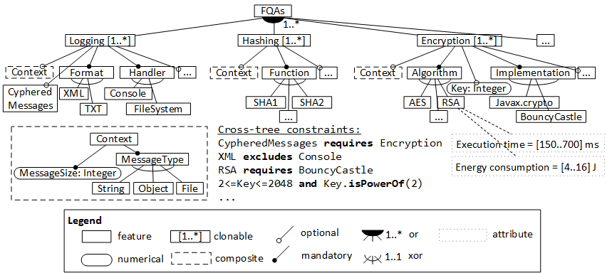

# Analysis of the Tool Support
This project answers the following research question:
> How the tools behave when they are used in complex SPLs?

The objective is to empirically analyzing the most usable SPL tools. We use a running case study based on an SPL process for Functional Quality Attributes ([WeaFQAs](https://hdl.handle.net/10630/17231)) with demanding characteristics such as clonable features, variable features, attributes, huge feature models, and so on.
This project contains the artifacts developed in different SPL tools to carry out the [WeaFQAs](https://hdl.handle.net/10630/17231) SPL process.

Variability model of the [Functional Quality Attributes (FQAs)](https://doi.org/10.1016/j.infsof.2017.10.018):

## Main Artifacts
* The FQAs variability model in different formats.
* The FQAs software architecture implemented with different variability approaches.
* The FQAs software architecture in UML.
* Other artifacts like model to model transformations that implement specific variation points (e.g., *ObjectExistence* in CVL).

**Note:** Further information about the artifacts as well as other specific artifacts of each tool can be consulted in each project below:

## Procedure
For each tool, visit its corresponding project that contains specific artifacts and instructions:
* [S.P.L.O.T.](SPLOT/)
* [Clafer](Clafer/)
* [FeatureIDE](FeatureIDE/)
* [Glencoe](Glencoe/)
* [FAMA](FAMA/)
* [pure::variants](PureVariants/)
* [vEXgine](vEXgine/)

## References
* [The WeaFQAs complete process (Thesis)](https://hdl.handle.net/10630/17231)
* [WeaFQAs and its architectural implementations](https://doi.org/10.1016/j.jss.2015.11.005)  
* [WeaFQAs and Non-Functional Properties](https://doi.org/10.1016/j.infsof.2017.10.018)
