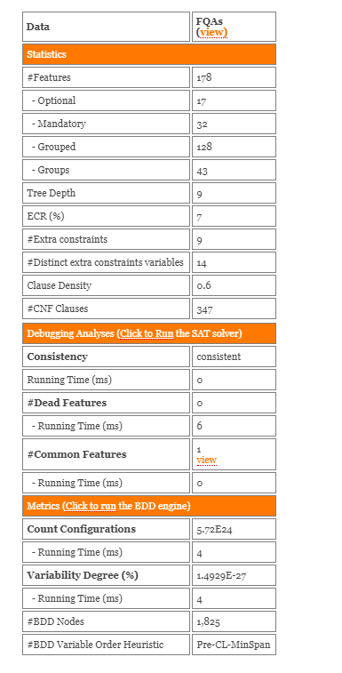

# S.P.L.O.T.
The FQAs variability model in S.P.L.O.T.

## Model Information
* Number id in SPLOT: #1,087 (non stable, can vary)
* Name: FQAs  
* Author: José Miguel Horcas Aguilera  
* Creation Date: February 2019  
* Number of features: 178  
* Number of configurations: 5.72e24  
* URL: http://52.32.1.180:8080/SPLOT/SplotAnalysesServlet?action=show_model_details&modelFile=model_20190219_265960660.xml

## Artifacts
* The [FQAs feature model](FQAs-featuremodel.xml) in SXFM format (.xml).

## Procedure
Here are the instructions to manage and work with the FQAs variability model in S.P.L.O.T.:

###### Download the variability model:
You can download the variability model in SXFM format (.xml) directly from this repository ([here](FQAs-featuremodel.xml)), or consult and download it directly from the S.P.L.O.T. tool ([here](http://52.32.1.180:8080/SPLOT/SplotAnalysesServlet?action=show_model_details&modelFile=model_20190219_265960660.xml)).

###### Modify, save, and export the variability model:
1. In [S.P.L.O.T.](http://www.splot-research.org/), clic on the `Feature Model Editor` menu.
2. Select the `Edit an Existing Model` option.
3. Search for the model named 'FQAs' of the author 'José Miguel Horcas Aguilera' with the creation date on 'February 2019'; select the model and clic on the button `Click Here` at the top of the page.
4. Edit the model to your needs in the `Feature Diagram` tree-like section and in the `Cross-Tree Constraints` section.
5. The model can be saved to the SPLOT repository (`Save to Repository` button), or exported to SXFM format (`Export` button).
6. Some basic statistics can be observed in the `Feature Model Statistics` and in the `Feature Model Analysis` sections on the right side.

###### Analyze the variability model:
To obtain more advance statistics, debugging analyses, and metrics:

1. In [S.P.L.O.T.](http://www.splot-research.org/), clic on the `Automated Analysis` menu.
2. Search for the model named 'FQAs' of the author 'José Miguel Horcas Aguilera' with the creation date on 'February 2019'; select the model and clic on the button `Click Here` at the top of the page.
3. In the new page, clic the `Click to Run` links below to run feature model analysis based on SAT solvers and Binary Decision Diagrams.
A similar analysis to the following should appear:

###### Create a product configuration form the variability model:
1. In [S.P.L.O.T.](http://www.splot-research.org/), clic on the `Product Configuration` menu.
2. Select the `Click to use the Interactive Configuration feature` link.
3. Search for the model named 'FQAs' of the author 'José Miguel Horcas Aguilera' with the creation date on 'February 2019'; select the model and clic on the button `Click Here` at the top of the page.
4. In the new page, make selections of the features based on the requirements of your product. A step by step configuration process will assist you, with the possibility to auto-complete the configuration with `Less Features` or `More Features`.

## References
* [S.P.L.O.T.](http://www.splot-research.org/)
