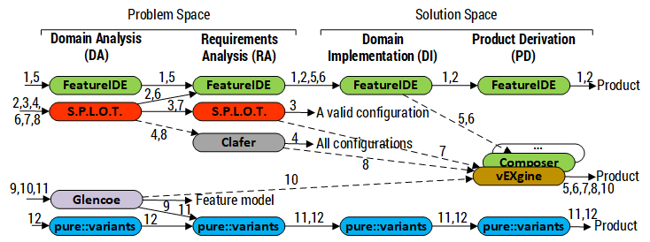

# Tooling Roadmaps
The tooling roadmaps answers the following research question:
> Is it possible to carry out a complete SPL process with the existing tool support?

Practical roadmaps to carry out an SPL process with the existing tol support:

The tooling roadmaps helps to integrate independent tools. This project contains the instructions to connect the different tools following the roadmaps (solid lines in the roadmaps). It also contains the implemented scripts and algorithms to fill some of the possible connection between the roadmaps (dashed lines).

## Artifacts
* [Tooling roadmaps](roadmaps.png).
* [SPLOT2Clafer](https://github.com/jmhorcas/SPLOT2Clafer) script to connect the S.P.L.O.T. and Clafer tools (roadmap 4, and 8).

## Procedure
Here we explain how to connect each tool based on the roadmaps.
* **Roadmaps 2,6 (S.P.L.O.T. to FeatureIDE):** FeatureIDE can import the feature model created with S.P.L.O.T. (in XSFM format). To do that, in FeatureIDE, inside a FeatureIDE's project, select the current feature model, open the contextual menu and select the `FeatureIDE → Import Feature Model` option. Select the XSFM (.xml) file generated with S.P.L.O.T.

* **Roadmaps 9,11 (Glencoe to pure::variants):** [Glencoe](https://glencoe.hochschule-trier.de/) allows exporting the feature model to the pure::variants format (.xfm file). To do that, in Glencoe, select the `EXPORT` option and then select the `pure::variants` data format. The .xfm file is automatically downloaded.

* **Roadmaps 4,8 (S.P.L.O.T. to Clafer)**: To convert the feature model created with [S.P.L.O.T.](http://www.splot-research.org/) to an equivalent feature model in Clafer use the [SPLOT2Clafer](https://github.com/jmhorcas/SPLOT2Clafer) script. This script has been specifically developed to cover this part of the roadmaps. To use it, download the [SPLOT2Clafer.jar](https://github.com/jmhorcas/SPLOT2Clafer/blob/master/SPLOT2Clafer.jar) file, and execute it with:  
 `java -jar SPLOT2Clafer.jar <<SPLOTfeaturemodel.xml>>`

* **Roadmaps 5,6,7,8,10 (to vEXgine or FeatureIDE composers)**: To connect the different tools with [vEXgine](http://caosd.lcc.uma.es/vexgine/) or a FeatureIDE composer, in order to resolve the variability specified in the feature model, it is necessary to implement an specific parser/converter for each tool.  
  **Note:** This is part of the future work of this project.

## References
* [FeatureIDE](http://www.featureide.com/)
* [S.P.L.O.T.](http://www.splot-research.org/)
* [Clafer](https://www.clafer.org/)
* [Glencoe](https://glencoe.hochschule-trier.de/)
* [pure::variants](https://www.pure-systems.com/)
* [vEXgine](http://caosd.lcc.uma.es/vexgine/)
